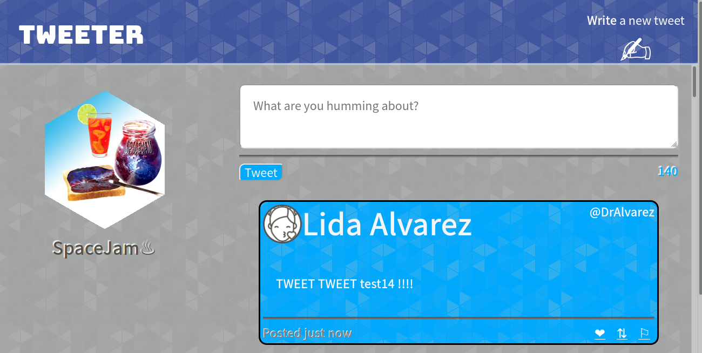
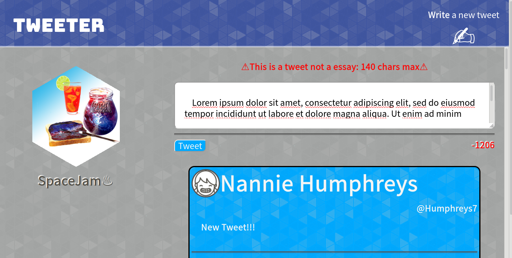
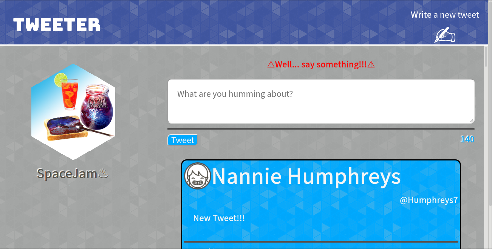

# Tweeter Project

Tweeter is a simple, single-page Twitter clone. Made with HTML, CSS, JS, jQuery and AJAX front-end skills, and Node, Express and MongoDB back-end skills.

## Getting Started

1. Fork this repository, then clone your fork of this repository.
2. Install dependencies using the `npm install` command.
3. Start the web server using the `npm run local` command. The app will be served at <http://localhost:8080/>.
4. Go to <http://localhost:8080/> in your browser.

## Features

* Create tweets 
* Tweets are ordered from top to bottom based on creation 
* Tweets have a character counter that counts down from 140
* Cant tweet empty tweets and over 140 character limit
* Responsive design 
* Color scheme changes when screen width changes
* Header and navigation bar fixed tweets scroll independently

## Screen Shots 

## known bugs and missing features
* Character counter only updates when form is changed
* Becuase page can sometimes scrolls automatically the main page scrollbar had to be included the tweet scrollbar works perfectly regardless.
  
## Dependencies

- Express
- Node 5.10.x or above
